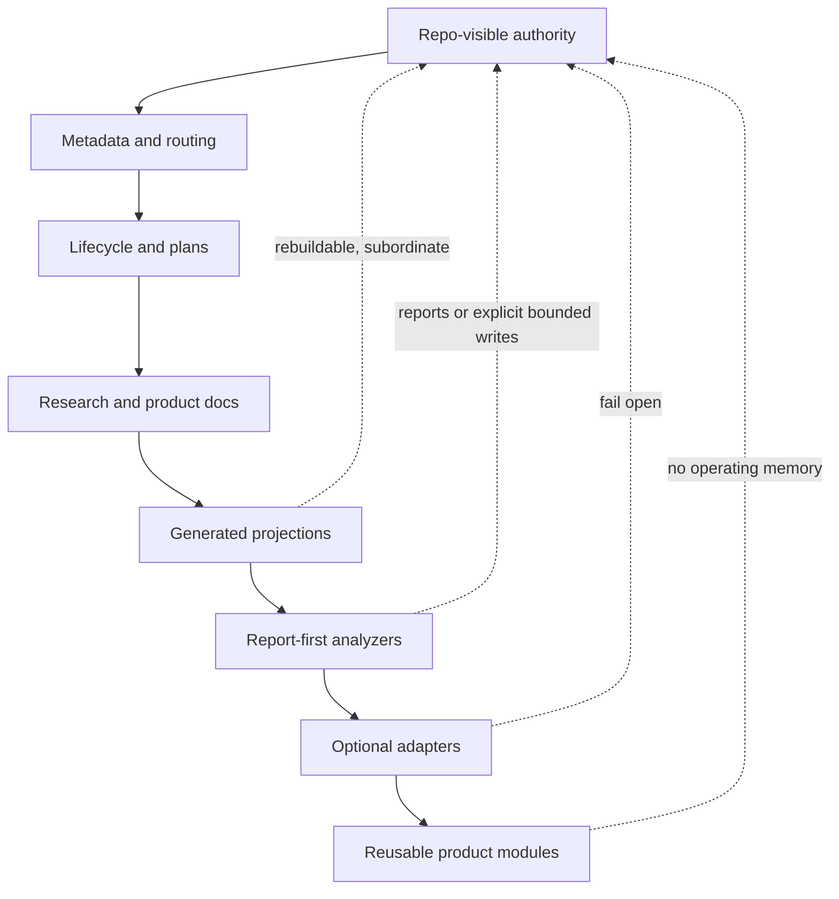

# MyLittleHarness Layer Model

## Layer Summary

| Layer | Product role | Authority status | Future product surface |
| --- | --- | --- | --- |
| Core authority | Current focus, canonical pointers, accepted workflow truth, stable contracts | Canonical only in the operating root or stable product docs/specs | Attach/status/validate contracts after explicit plan |
| Contract and rules | Normative safety boundaries, source-set discipline, risk rules, field split | Product docs/specs state the reusable rule; operating specs govern current workflow | Product specs and compatibility fixture checks |
| Navigation and routing | Cheap start, attention tiers, docmap, policy/evidence routing | Advisory unless promoted into state/specs | Docmap/link/stale-pointer reports |
| Lifecycle and planning | Incubation, research, active plans, Horizon posture, closeout | Current operating-root workflow concern; the operating root owns live lifecycle state | Plan synthesis and closeout helpers |
| Coordination substrate | Claims, runs, handoffs, session work, worktree coordination, and route receipts | Repo-visible evidence and conflict visibility, not lifecycle authority | Claim, evidence, handoff, session-work, worktree, and reconcile helpers |
| Power layer | Replay packets, research artifact intake, distillate validation, comparative research, selective helpers | Evidence and leverage, not authority; substantive synthesis belongs to agents/humans | Research, evidence, and closeout helpers |
| Projection, cache, and index | Generated maps, SQLite, search, semantic readiness/evaluation inputs, backlinks, telemetry | Rebuildable and subordinate | Repo-map/search/SQLite tooling plus later semantic retrieval gates |
| Automation and analyzer | Diagnostics, project intelligence reports, detach dry-run/apply marker posture, hidden-help tasks/bootstrap diagnostics, explicit package-smoke verification, semantic readiness inspection, bounded no-runtime semantic evaluation, optional preflight warnings/templates, consistency checks, dry-run proposals, no-write snapshot plans, explicit safe apply, bounded state frontmatter repair, bounded docmap repair, create-only AGENTS repair, create-only stable spec repair, and explicit closeout/state writeback | Reports, stdout-only templates, temporary package-smoke workspaces outside the product root, create-only writes, marker-only detach evidence, selected state frontmatter updates, selected AGENTS creation, selected docmap creation, selected stable spec fixture creation, selected docmap route updates, synchronized closeout writeback state and derived active-plan metadata, and snapshot evidence only under scoped product contracts | Analyzer CLI modules |
| Adapter | Skills, MCP read projection, browser, IDE, Git/GitHub/CI, hooks, task runners | Optional and fail-open | Current MCP-style inspect report and explicit stdio tool server, current preflight warning feed and hook template, plus future adapter/projection packages |
| Workstation and substrate | Roots, tools, manifests, PATH/profile checks, caches, logs, workspaces, bootstrap, publishing, and workstation adoption | Local substrate unless a portable contract promotes it | Current read-only hidden-help bootstrap readiness report plus future configurable bootstrap/status helpers |
| Product module | Reusable CLI/modules/docs/fixtures plus local package smoke posture | Product source, not operating memory or package artifact storage | `src/mylittleharness`, tests, `pyproject.toml`, and `docs/...` |
| Reject | Anti-patterns that violate authority, rebuildability, or solo leverage | Out of product architecture unless reclassified by scoped design | No destination |

MyLittleHarness serves one explicit target repository at a time.

## Flow

## Layer Rules

- Authority layers must be human-readable and recoverable from files.
- Routing layers may help a reader find the right artifact, but weak semantic matches cannot authorize mutation.
- Lifecycle layers keep plans bounded and prevent research, incubation, active work, and archives from collapsing into one file.
- The coordination substrate makes parallel work visible through claims, runs, handoffs, session work, worktree coordination, and route receipts. It must remain recoverable from repo-visible records; no dashboard, daemon, hook, dispatcher, MCP, or A2A adapter may replace those records as truth.
- Projection layers accelerate retrieval and checks, but every projection must be safe to delete and rebuild; semantic readiness and bounded evaluation can inspect projection/search posture before any semantic runtime exists.
- Analyzer layers report drift before repair; detach dry-run, marker-only detach apply, hidden-help bootstrap readiness, package-smoke verification, semantic readiness, bounded semantic evaluation, explicit closeout/state writeback dry-run, and optional preflight warnings/templates may assemble existing report signals, but mutation requires an explicit scoped product contract, and existing-content repair requires target-bound snapshot behavior before writes.
- Adapter layers improve ergonomics and integration, but they cannot own memory or correctness; the current MCP-style adapter slice includes read-only inspect and explicit stdio serving, and writes no adapter state.
- Product modules package reusable helpers only after docs/specs define their boundary; current package smoke checks must keep virtual environments, wheels, build directories, and egg-info outside the product source root.

## Gate Discipline

A capability can move down the layer stack only when its safety boundary is explicit:

- source of truth named
- generated or adapter state demoted
- failure mode fail-open
- rebuild/delete story documented
- product, operating, fallback, and generated-output root placement clear
- shipped runtime requirements stay limited to the product and explicit target repository
- snapshot/rollback posture documented for existing-content mutation
- optional dependency and degraded/offline posture named when a runtime or provider is introduced
- verification method available
- release closeout evidence assigned to the operating root
- non-goals and rejected shapes visible

Capabilities that cannot pass those gates stay as research-only carry-forward or explicit rejects.
